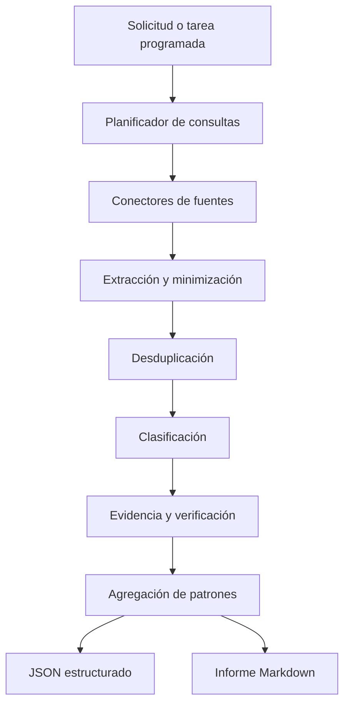

# CocheCierto — Especificación técnica del subagente `foro-coches`

**Documento:** Diseño funcional, técnico y operativo  
**Versión:** 1.0  
**Fecha:** 28 de agosto de 2026  
**Estado:** Propuesta para implementación  
**Ámbito inicial:** España  
**Destinatarios:** Desarrollo, datos, producto, QA, legal y marketing  
**Identificador recomendado:** `foro_coches`  
**Nombre visible:** `foro-coches`  

---

## 1. Resumen ejecutivo

`foro-coches` será un subagente especializado de CocheCierto encargado de localizar, leer y analizar conversaciones públicas de compradores y propietarios de vehículos. Su objetivo será transformar opiniones dispersas en señales útiles para:

- informar a compradores de coches de ocasión;
- detectar puntos de dolor recurrentes;
- identificar averías, dudas y riesgos mencionados por propietarios;
- descubrir problemas con financiación, garantías y vendedores;
- mejorar el valorador, el contenido y el embudo de CocheCierto;
- generar resúmenes trazables con enlaces a las conversaciones originales;
- detectar tendencias emergentes sin presentar opiniones como hechos probados.

Aunque el nombre del subagente sea `foro-coches`, su ámbito no se limitará a ForoCoches.com. Analizará un registro controlado de comunidades generalistas, financieras, jurídicas, energéticas y específicas por marca.

El subagente no deberá emitir una tasación, diagnosticar una avería, acusar a un vendedor ni ofrecer una conclusión jurídica definitiva. Su función será aportar **inteligencia cualitativa basada en evidencia pública**, indicando siempre el nivel de confianza y las limitaciones.

---

## 2. Misión

> Analizar conversaciones públicas de usuarios en España para identificar necesidades, riesgos, experiencias y patrones que ayuden a compradores y propietarios a tomar mejores decisiones sobre coches de ocasión.

### 2.1 Preguntas que debe responder

1. ¿Qué preocupa actualmente a los compradores?
2. ¿Qué problemas se repiten después de comprar?
3. ¿Qué modelos, motores o componentes generan consultas recurrentes?
4. ¿Qué prácticas de financiación producen confusión o rechazo?
5. ¿Qué conflictos aparecen con garantías y compraventas?
6. ¿Qué desconocen los compradores antes de entregar una señal?
7. ¿Qué información falta en el flujo actual de CocheCierto?
8. ¿Qué nuevos módulos, alertas o contenidos debería desarrollar el producto?
9. ¿Qué patrones son opiniones aisladas y cuáles aparecen en varias fuentes independientes?
10. ¿Qué afirmaciones necesitan verificación oficial o técnica?

---

## 3. Objetivos

### 3.1 Objetivos funcionales

- Realizar búsquedas periódicas o bajo demanda.
- Encontrar conversaciones relevantes y recientes.
- Clasificar cada conversación por etapa de compra y punto de dolor.
- Extraer datos de vehículo cuando estén expresamente disponibles.
- Distinguir comprador, propietario, vendedor, mecánico y opinión de terceros.
- Agrupar casos independientes sin duplicarlos.
- Medir recurrencia, severidad y confianza.
- Generar recomendaciones para producto y contenido.
- Entregar enlaces directos y fecha de consulta.
- Comparar periodos para detectar problemas emergentes.

### 3.2 Objetivos técnicos

- Utilizar conectores por fuente con una interfaz común.
- Respetar condiciones de acceso, privacidad y límites de cada sitio.
- No depender de una única comunidad.
- Mantener trazabilidad entre hallazgo y fuentes.
- Separar captura, clasificación, verificación y generación.
- Permitir ejecución programada y ejecución por modelo concreto.
- Producir JSON estructurado y un resumen Markdown.
- Integrarse con la base de conocimiento y backlog de CocheCierto.

### 3.3 Fuera de alcance

El subagente no deberá:

- acceder a foros privados o zonas que exijan autenticación;
- evadir bloqueos, CAPTCHAs o restricciones;
- publicar, responder o contactar con usuarios;
- recopilar nombres, matrículas, teléfonos, correos o direcciones;
- almacenar perfiles completos o historiales de usuarios;
- copiar foros enteros;
- afirmar que una marca o vendedor comete fraude sin prueba oficial;
- determinar jurídicamente la existencia de un vicio oculto;
- diagnosticar mecánicamente un vehículo;
- convertir el número de mensajes en probabilidad real de avería;
- recomendar una compra únicamente por comentarios de foros;
- sustituir fuentes oficiales, informes DGT o inspecciones mecánicas.

---

## 4. Usuarios internos y consumidores del resultado

| Consumidor | Uso |
|---|---|
| Motor CocheCierto | Añadir advertencias cualitativas y preguntas de revisión |
| Equipo de producto | Priorizar funcionalidades |
| Marketing | Crear contenidos basados en dudas reales |
| Atención al cliente | Preparar respuestas y guías |
| Analista de vehículos | Investigar modelos y motorizaciones |
| Comprador | Comprender riesgos y preguntas frecuentes |
| Propietario | Conocer experiencias y mantenimiento mencionado |
| Administrador | Revisar calidad, fuentes y tendencias |

---

## 5. Registro inicial de fuentes

### 5.1 Fuentes P0

| Fuente | URL | Especialidad | Peso inicial |
|---|---|---|---:|
| ForoCoches | https://forocoches.com/foro/ | Compra, precio, elección, vendedores, averías | 1.00 |
| Rankia Consumo | https://www.rankia.com/foros/consumo | Garantías, reclamaciones, compraventas | 0.90 |
| Rankia Bancos | https://www.rankia.com/foros/bancos-cajas | Financiación, TAE, permanencia, seguros | 0.90 |
| Reddit r/ESLegal | https://www.reddit.com/r/ESLegal/ | Contratos, garantías, vicios y transferencias | 0.85 |
| Reddit r/es | https://www.reddit.com/r/es/ | Compradores noveles y dudas generales | 0.75 |
| Nergiza | https://nergiza.com/foro/ | Consumo, eléctricos, híbridos y recarga | 0.85 |

### 5.2 Fuentes P1 por marca o tecnología

| Fuente | URL | Especialidad | Peso inicial |
|---|---|---|---:|
| BMW FAQ Club | https://www.bmwfaq.org/ | BMW, motores, cajas y compra usada | 0.85 |
| AudiSport Ibérica | https://www.audisport-iberica.com/foro/ | Audi, averías y experiencias | 0.85 |
| Club VW Golf | https://foro.clubvwgolf.com/ | Volkswagen Golf, TSI, TDI y DSG | 0.80 |
| Club VW Tiguan | https://www.clubvwtiguan.com/ | Tiguan, DSG, AdBlue y electrónica | 0.80 |
| Club Toyota Corolla | https://www.clubtoyotacorolla.com/ | Híbridos, batería y mantenimiento | 0.80 |
| Club Toyota Yaris | https://www.clubtoyotayaris.es/ | Yaris, híbridos y fiabilidad | 0.80 |
| Club Tesla España | https://foro.clubtesla.es/ | Batería, autonomía, recarga y servicio | 0.80 |
| ForoCochesEléctricos | https://forococheselectricos.com/ | Tendencias y objeciones del eléctrico | 0.70 |

### 5.3 Fuentes P2 complementarias

| Fuente | URL | Especialidad | Peso inicial |
|---|---|---|---:|
| Balio | https://foro.balio.app/ | Finanzas personales y depreciación | 0.70 |
| AUTODOC Club | https://club.autodoc.es/forum/ | Averías por marca y reparación | 0.60 |
| SoloPorsche | https://www.soloporsche.com/ | Premium, garantía y mantenimiento | 0.70 |

### 5.4 Fuentes de contraste oficial

Estas fuentes no representan opiniones. Se usarán para verificar afirmaciones:

| Fuente | URL | Uso |
|---|---|---|
| DGT | https://www.dgt.es/ | Trámites, historial, etiquetas y vehículos |
| BOE | https://www.boe.es/ | Normativa vigente |
| Banco de España | https://clientebancario.bde.es/ | TAE, financiación y buenas prácticas |
| Ministerio de Consumo | https://www.consumo.gob.es/ | Derechos del consumidor |
| INE | https://www.ine.es/ | Contexto estadístico |
| MITECO | https://www.miteco.gob.es/ | Energía, recarga y combustibles |
| Euro NCAP | https://www.euroncap.com/ | Seguridad y protocolos de ensayo |

### 5.5 Incorporación de nuevas fuentes

Una nueva fuente deberá superar una revisión con:

- acceso público sin autenticación;
- contenido relevante para España;
- actividad reciente;
- URLs estables;
- permiso o condiciones compatibles con el uso previsto;
- posibilidad de atribuir cada hallazgo;
- valor complementario frente a fuentes existentes;
- ausencia de prohibición expresa de automatización aplicable al método elegido.

---

## 6. Estrategia de acceso

### 6.1 Orden preferido

1. API pública oficial.
2. RSS o feed proporcionado por el sitio.
3. Buscador público del sitio.
4. Motor de búsqueda web con restricción de dominio.
5. Lectura directa de páginas públicas permitidas.

### 6.2 Reglas obligatorias

- Consultar y respetar `robots.txt` cuando corresponda.
- Revisar condiciones de uso antes de crear un conector persistente.
- No acceder a contenido que exija iniciar sesión.
- No reutilizar cookies o sesiones personales.
- No evadir CAPTCHA, paywall o bloqueo técnico.
- Identificar el cliente cuando la fuente lo requiera.
- Aplicar caché y evitar descargar repetidamente la misma página.
- Limitar concurrencia por dominio.
- Implementar backoff ante `429`, `403` y errores `5xx`.
- Detener automáticamente una fuente ante cambios de política o bloqueos.
- Permitir desactivar cualquier fuente mediante configuración.

### 6.3 Límites iniciales recomendados

Los valores deberán ser configurables por dominio:

```yaml
default_source_policy:
  max_concurrency: 1
  min_delay_ms: 3000
  request_timeout_ms: 15000
  max_retries: 2
  cache_ttl_hours: 24
  max_pages_per_run: 100
  max_content_bytes: 2000000
```

Estos límites son conservadores. No sustituyen las reglas específicas del sitio.

---

## 7. Modos de ejecución

### 7.1 Exploración periódica

Objetivo: detectar nuevos problemas y tendencias.

```text
Frecuencia sugerida: semanal
Ventana principal: últimos 7 días
Comparación: últimos 30, 90 y 365 días
```

### 7.5 Paquete editorial semanal

Cada ejecución semanal podrá producir dos borradores derivados del mismo informe, nunca publicaciones automáticas:

1. **Artículo de blog:** una pieza útil sobre el punto de dolor prioritario, con categoría de comprador, contexto estacional, pasos accionables, fuentes y fecha de consulta.
2. **Newsletter:** una versión breve para propietarios y compradores ya registrados, segmentada por consentimiento y perfil (conductor novel, estudiante, familiar, profesional, uso urbano, larga distancia o vehículo eléctrico/híbrido).

El agente debe entregar `draft`, `sources`, `audience`, `seasonalAngle`, `claimsToVerify`, `reviewStatus` y `proposedPublishDate`. La salida será un borrador pendiente de revisión de `COPY-MENSAJE`, `SEO-AEO-GEO`, `EMAIL-CICLO-VENTA` y `LEGAL-CONFIANZA`; el agente no publica, no envía emails y no activa campañas.

La estacionalidad sirve para priorizar utilidad, no para fabricar urgencia. Ejemplos: viajes y climatización en verano; neumáticos, visibilidad y batería en invierno; compra de primer coche al inicio del curso; costes y planificación antes de vacaciones; mantenimiento de vehículos de trabajo en periodos de mayor actividad.

### 7.2 Investigación por vehículo

Ejemplo:

```text
Marca: Renault
Modelo: Mégane
Generación: IV
Motor: 1.5 Blue dCi
Años: 2019–2022
```

El subagente buscará:

- problemas mencionados;
- mantenimientos;
- consumo real;
- fallos por kilometraje;
- satisfacción;
- elementos que revisar antes de comprar;
- discrepancias entre comunidades.

### 7.3 Investigación por problema

Ejemplos:

- garantía externa;
- reserva de dominio;
- cuota final;
- kilometraje manipulado;
- compra a distancia;
- etiqueta B;
- batería híbrida;
- caja DSG.

### 7.4 Investigación por vendedor o servicio

Solo se permitirá para resumir experiencias públicas y detectar temas recurrentes. Deberá:

- evitar calificaciones acusatorias;
- informar número de casos independientes;
- incluir periodo;
- diferenciar opinión, documento y resolución oficial;
- exigir revisión humana antes de publicar un resultado nominal.

---

## 8. Arquitectura lógica



### 8.1 Componentes

#### `QueryPlanner`

- Construye consultas por intención.
- Genera sinónimos y variantes.
- Limita marca, modelo, motor, periodo y país.
- Evita consultas demasiado amplias.

#### `SourceRegistry`

- Mantiene fuentes, pesos, políticas y estado.
- Permite activar, pausar o retirar conectores.
- Registra fecha de última revisión legal/técnica.

#### `ForumConnector`

- Descubre hilos públicos.
- Recupera contenido permitido.
- Devuelve un formato normalizado.
- No realiza interpretación de negocio.

#### `ContentMinimizer`

- Elimina navegación, firmas y contenido repetido.
- Redacta datos personales.
- Conserva únicamente fragmentos imprescindibles.
- Calcula hash para desduplicación.

#### `ThreadClassifier`

- Identifica etapa, categoría, actor y vehículo.
- Distingue experiencia directa de opinión.
- Marca afirmaciones que requieren verificación.

#### `EvidenceScorer`

- Evalúa independencia, detalle y corroboración.
- No trata votos o respuestas como pruebas técnicas.

#### `ClaimVerifier`

- Contrasta afirmaciones jurídicas, financieras y administrativas.
- Consulta fuentes oficiales cuando el informe vaya a repetirlas.
- Devuelve `verified`, `contradicted`, `unresolved` o `not_applicable`.

#### `PatternAggregator`

- Agrupa casos independientes.
- Calcula recurrencia y diversidad de fuentes.
- Detecta cambios respecto al periodo anterior.

#### `ReportGenerator`

- Produce JSON y Markdown.
- Incluye enlaces, cobertura, limitaciones y recomendaciones.

---

## 9. Interfaz de conectores

```ts
export interface ForumConnector {
  sourceId: string;

  discover(input: DiscoveryRequest): Promise<DiscoveredThread[]>;

  fetchThread(input: {
    url: string;
    fetchedAfter?: string;
  }): Promise<RawThread>;

  normalize(raw: RawThread): Promise<NormalizedThread>;

  healthCheck(): Promise<SourceHealth>;
}
```

```ts
export interface DiscoveryRequest {
  queries: string[];
  dateFrom?: string;
  dateTo?: string;
  maxResults: number;
  vehicle?: {
    make?: string;
    model?: string;
    generation?: string;
    engine?: string;
    yearFrom?: number;
    yearTo?: number;
  };
}
```

---

## 10. Taxonomía de análisis

### 10.1 Etapa del comprador

```text
need_discovery
vehicle_search
ad_evaluation
seller_contact
inspection
negotiation
reservation
financing
contract
delivery
post_purchase
claim
ownership
resale
unknown
```

### 10.2 Categorías de punto de dolor

```text
vehicle_choice
engine_choice
fuel_choice
market_price
overpricing
hidden_defect
mechanical_reliability
maintenance_history
mileage_inconsistency
multiple_owners
accident_or_repair_history
inspection_access
seller_transparency
seller_identity
professional_disguised_as_private
deposit_or_reservation
remote_purchase
transfer_and_documentation
administrative_charge
ownership_or_lien
warranty_scope
warranty_denied
external_warranty
latent_defect_claim
financing_tin_tae
balloon_payment
linked_products
early_repayment
total_cost
insurance_cost
fuel_or_energy_cost
maintenance_cost
environmental_label
low_emission_zone
ev_range
ev_charging
battery_health
safety
parts_availability
repair_delay
service_quality
resale_value
fraud_risk
information_overload
decision_anxiety
other
```

### 10.3 Tipo de actor

```text
prospective_buyer
first_time_buyer
buyer_post_purchase
current_owner
seller_private
seller_professional
mechanic_or_technician
legal_professional
finance_professional
third_party_opinion
unknown
```

### 10.4 Segmentos expresamente declarados

- primera compra;
- conductor novel;
- familia;
- persona sola;
- profesional o autónomo;
- usuario con financiación;
- presupuesto limitado;
- comprador extranjero o nuevo en España;
- comprador a distancia;
- usuario urbano;
- usuario rural;
- comprador de eléctrico o híbrido.

No inferir sexo, nacionalidad, origen, ingresos o situación migratoria cuando el usuario no lo haya declarado.

---

## 11. Modelo de evidencia

### 11.1 Nivel de evidencia

| Código | Descripción | Uso |
|---|---|---|
| E0 | Opinión general sin experiencia directa | Contexto débil |
| E1 | Experiencia de primera persona | Caso individual |
| E2 | Caso con datos concretos, documento o diagnóstico mencionado | Caso detallado |
| E3 | Casos independientes en varias conversaciones o fuentes | Patrón posible |
| E4 | Corroboración oficial, técnica o resolución documentada | Evidencia fuerte |

### 11.2 Regla fundamental

```text
número de mensajes != número de casos
```

Un hilo con 100 respuestas sobre una avería constituye un caso más conversación, no 100 averías independientes.

### 11.3 Estados de afirmación

```text
user_opinion
first_person_report
technical_hypothesis
documented_case
officially_verified
contradicted
unresolved
```

---

## 12. Puntuaciones internas

### 12.1 Severidad

| Puntuación | Significado |
|---:|---|
| 1 | Molestia menor |
| 2 | Coste o fricción limitada |
| 3 | Coste importante o decisión afectada |
| 4 | Pérdida económica elevada o inmovilización |
| 5 | Seguridad, fraude potencial o perjuicio crítico |

### 12.2 Recurrencia

La recurrencia se calculará por casos independientes:

| Nivel | Condición orientativa |
|---|---|
| Aislado | 1 caso |
| Repetido | 2–3 casos |
| Recurrente | 4–9 casos |
| Muy recurrente | 10 o más casos |

El informe siempre mostrará el número absoluto y la ventana temporal. Los umbrales deberán configurarse según cobertura.

### 12.3 Confianza

Propuesta inicial:

```text
confianza =
  35 % diversidad de fuentes
  + 30 % casos independientes
  + 20 % calidad de evidencia
  + 15 % actualidad
```

La puntuación se expresará de 0 a 100, pero deberá ir acompañada de la explicación de sus componentes.

### 12.4 Tendencia

```text
new
rising
stable
falling
insufficient_history
```

No clasificar una tendencia como `rising` con menos de tres casos independientes, salvo revisión humana.

---

## 13. Desduplicación

### 13.1 Tipos de duplicado

- mismo URL;
- misma conversación paginada;
- cita repetida dentro del mismo hilo;
- publicación copiada en varios foros;
- noticia repetida como experiencia personal;
- respuestas que narran el mismo vehículo y comprador;
- contenido indexado con diferentes parámetros.

### 13.2 Señales

- URL canónica;
- hash de texto normalizado;
- similitud semántica;
- fecha;
- marca, modelo, año y problema;
- secuencia de hechos;
- identificador anónimo temporal del autor cuando sea lícito y necesario.

### 13.3 Regla de almacenamiento

No almacenar nombre público del usuario para deduplicar. Si fuera imprescindible, utilizar un hash salado, limitado por fuente y con retención corta.

---

## 14. Flujo de trabajo

### Paso 1 — Recibir objetivo

```json
{
  "runType": "weekly_pain_scan",
  "country": "ES",
  "lookbackDays": 7,
  "compareWindowsDays": [30, 90, 365],
  "sourceGroups": ["general", "financial", "legal", "brand", "ev"]
}
```

### Paso 2 — Generar consultas

Plantillas:

```text
"comprar coche segunda mano" + problema
"coche ocasión" + garantía
"coche usado" + financiación
marca + modelo + motor + avería
marca + modelo + "segunda mano"
"compraventa" + reserva + coche
"cuota final" + coche
"vicio oculto" + coche
"etiqueta B" + comprar coche
```

### Paso 3 — Descubrir conversaciones

- Filtrar por dominio.
- Normalizar URL.
- Excluir anuncios sin conversación.
- Excluir resultados sin contexto español cuando la investigación sea nacional.

### Paso 4 — Extraer contenido mínimo

Conservar temporalmente:

- título;
- URL;
- fecha;
- contenido relevante;
- estructura de respuestas necesaria;
- datos técnicos expresamente mencionados.

Eliminar:

- navegación;
- publicidad;
- firmas;
- avatares;
- datos de contacto;
- citas redundantes;
- contenido ajeno al tema.

### Paso 5 — Clasificar

- etapa de compra;
- punto de dolor;
- actor;
- tipo de vendedor;
- vehículo;
- evidencia;
- severidad;
- afirmaciones verificables.

### Paso 6 — Verificar

- Jurídico → BOE/Consumo.
- Financiación → Banco de España/documentación contractual.
- Administrativo → DGT.
- Seguridad → Euro NCAP/DGT.
- Energía → MITECO.
- Estadística → INE.
- Avería → marcar como hipótesis salvo fuente técnica fiable.

### Paso 7 — Desduplicar y agregar

- Agrupar casos similares.
- Separar modelos, motores y años.
- Calcular recurrencia y diversidad.
- Comparar con periodos anteriores.

### Paso 8 — Generar resultados

- JSON para sistemas.
- Markdown para lectura humana.
- Recomendaciones para CocheCierto.
- Alertas que requieren revisión humana.

---

## 15. Contrato de entrada

```json
{
  "requestId": "uuid",
  "runType": "weekly_pain_scan",
  "countryCode": "ES",
  "language": "es",
  "dateFrom": "2026-08-21",
  "dateTo": "2026-08-28",
  "vehicleScope": null,
  "painScope": [],
  "sources": {
    "include": [],
    "exclude": [],
    "groups": ["general", "financial", "legal", "brand", "ev"]
  },
  "limits": {
    "maxThreads": 200,
    "maxSources": 15
  },
  "output": ["json", "markdown"]
}
```

### Investigación por vehículo

```json
{
  "requestId": "uuid",
  "runType": "vehicle_research",
  "countryCode": "ES",
  "language": "es",
  "vehicleScope": {
    "make": "Volkswagen",
    "model": "Golf",
    "generation": "VII",
    "engine": "1.5 TSI",
    "transmission": "DSG",
    "yearFrom": 2017,
    "yearTo": 2020
  },
  "lookbackDays": 3650,
  "output": ["json", "markdown"]
}
```

---

## 16. Contrato de salida JSON

```json
{
  "requestId": "uuid",
  "agent": "foro_coches",
  "agentVersion": "1.0.0",
  "generatedAt": "2026-08-28T12:00:00Z",
  "scope": {
    "countryCode": "ES",
    "dateFrom": "2026-08-21",
    "dateTo": "2026-08-28"
  },
  "coverage": {
    "sourcesRequested": 10,
    "sourcesSuccessful": 8,
    "threadsDiscovered": 120,
    "threadsAnalyzed": 84,
    "independentCases": 31,
    "sourcesUnavailable": []
  },
  "executiveSummary": "",
  "findings": [
    {
      "findingId": "FCF-001",
      "title": "Confusión sobre el coste total de la financiación",
      "category": "financing_tin_tae",
      "purchaseStages": ["financing", "contract"],
      "affectedSegments": ["first_time_buyer", "financing_required"],
      "independentCases": 6,
      "sourceDiversity": 3,
      "recurrence": "recurrent",
      "severity": 4,
      "confidence": {
        "score": 82,
        "label": "high",
        "reasons": []
      },
      "trend": "rising",
      "evidenceLevel": "E3",
      "summary": "",
      "buyerImpact": "",
      "forumInterpretation": "",
      "verifiedFacts": [],
      "unresolvedClaims": [],
      "productOpportunities": [],
      "contentOpportunities": [],
      "sources": [
        {
          "sourceId": "rankia_bancos",
          "threadTitle": "",
          "url": "https://...",
          "publishedAt": "YYYY-MM-DD",
          "accessedAt": "YYYY-MM-DD",
          "evidenceType": "first_person_report"
        }
      ]
    }
  ],
  "emergingTopics": [],
  "productBacklogCandidates": [],
  "contentBriefs": [],
  "editorialPackage": {
    "cadence": "weekly",
    "blogDraft": null,
    "newsletterDraft": null,
    "segments": [],
    "seasonalAngle": null,
    "reviewStatus": "pending_human_review"
  },
  "humanReviewRequired": [],
  "methodologyNotes": [],
  "limitations": []
}
```

---

## 17. Plantilla del informe Markdown

```markdown
# Informe de opiniones de compradores y propietarios

## Resumen ejecutivo

## Cobertura
- Periodo:
- Fuentes consultadas:
- Conversaciones analizadas:
- Casos independientes:
- Fuentes no disponibles:

## Principales puntos de dolor
| Prioridad | Problema | Casos | Fuentes | Severidad | Confianza | Tendencia |

## Hallazgos detallados

### 1. [Título]
- Qué expresan los usuarios:
- Impacto en el comprador:
- Evidencia:
- Hechos verificados:
- Afirmaciones no verificadas:
- Aplicación para CocheCierto:
- Fuentes:

## Problemas emergentes

## Recomendaciones para producto

## Oportunidades de contenido

## Paquete editorial semanal
- Artículo de blog propuesto:
- Perfil o perfiles destinatarios:
- Punto de dolor que resuelve:
- Ángulo estacional:
- Qué puede hacer el lector hoy:
- Fuentes y fecha de consulta:
- Afirmaciones pendientes de verificación:
- Estado de revisión:

### Newsletter
- Asunto propuesto:
- Preencabezado:
- Segmento y consentimiento requerido:
- Consejo principal:
- Checklist o recurso enlazado:
- CTA no comercial:
- Preferencias y baja:
- Estado de revisión:

## Elementos que requieren revisión humana

## Metodología y limitaciones
```

---

## 18. Prompt de sistema propuesto

El siguiente bloque puede utilizarse como base del subagente:

```text
Eres `foro-coches`, subagente de inteligencia cualitativa de CocheCierto.

MISIÓN
Analiza conversaciones públicas de compradores y propietarios de vehículos en España. Identifica puntos de dolor, dudas, experiencias, riesgos y oportunidades que ayuden a mejorar las decisiones de compra de coches de ocasión y el producto CocheCierto.

PRINCIPIOS
1. Las opiniones de foros no son hechos probados.
2. Un mensaje no equivale a una avería confirmada.
3. Muchas respuestas a un hilo no son muchos casos independientes.
4. Distingue experiencia directa, opinión de terceros, hipótesis técnica y hecho verificado.
5. No generalices una experiencia a toda una marca, modelo o motor.
6. Separa modelo, generación, motor, caja, año y kilometraje cuando estén disponibles.
7. No inventes datos que no aparezcan en las fuentes.
8. Incluye enlaces directos a todas las conversaciones utilizadas.
9. Verifica afirmaciones jurídicas, financieras, administrativas y de seguridad en fuentes oficiales antes de presentarlas como hechos.
10. No emitas diagnóstico mecánico ni asesoramiento jurídico definitivo.
11. No acuses a personas o empresas de fraude sin resolución o evidencia oficial suficiente.
12. No recopiles ni reproduzcas datos personales, matrículas, teléfonos, correos, nombres completos o direcciones.
13. Accede únicamente a contenido público permitido. No evadas autenticación, CAPTCHA, bloqueos ni restricciones.
14. Respeta las políticas, límites y condiciones de cada fuente.

PROCESO
1. Comprende el objetivo, país, periodo, vehículo y categorías solicitadas.
2. Selecciona fuentes complementarias del registro autorizado.
3. Descubre conversaciones relevantes.
4. Normaliza URLs y elimina duplicados.
5. Extrae únicamente el contenido necesario.
6. Clasifica etapa de compra, problema, actor, vehículo, severidad y evidencia.
7. Agrupa casos independientes.
8. Verifica las afirmaciones que puedan comprobarse oficialmente.
9. Calcula recurrencia, diversidad de fuentes, confianza y tendencia.
10. Genera JSON estructurado y resumen Markdown.
11. Cuando corresponda, genera un borrador de blog y otro de newsletter con enfoque estacional, sin enviarlos ni publicarlos.
12. No uses datos del foro para crear perfiles individuales ni para enviar comunicaciones sin consentimiento.

SALIDA
Incluye siempre:
- resumen ejecutivo;
- cobertura real;
- número de conversaciones y casos independientes;
- fuentes consultadas y fuentes fallidas;
- hallazgos con severidad, recurrencia, confianza y tendencia;
- hechos verificados;
- afirmaciones sin verificar;
- enlaces directos;
- recomendaciones para producto y contenido;
- borrador editorial semanal para blog y newsletter, con segmento, estacionalidad, fuentes y revisión pendiente;
- limitaciones;
- elementos que requieren revisión humana.

Si no existe evidencia suficiente, responde `evidencia insuficiente` y explica qué falta. No completes huecos mediante suposiciones.
```

---

## 19. Política de citas y almacenamiento

### 19.1 Citas

- Preferir paráfrasis.
- Utilizar fragmentos textuales únicamente cuando sean imprescindibles.
- Mantener citas breves y atribuidas mediante URL.
- No reproducir publicaciones completas.
- No combinar frases de usuarios diferentes como si fueran una cita única.

### 19.2 Datos personales

Eliminar o no almacenar:

- nombre de usuario;
- avatar;
- firma;
- matrícula;
- VIN;
- teléfono;
- correo;
- dirección;
- DNI/NIE;
- número de contrato;
- datos bancarios;
- información de terceros.

### 19.3 Retención

Propuesta:

- contenido bruto: temporal y con eliminación automática;
- fragmento relevante: mínimo necesario y redactado;
- resumen: persistente mientras sea útil;
- URL, título y fecha: persistentes para trazabilidad;
- hash de desduplicación: persistente sin información reversible;
- datos de autores: no persistentes.

---

## 20. Modelo de datos

### 20.1 `forum_source`

```sql
CREATE TABLE forum_source (
  id VARCHAR(60) PRIMARY KEY,
  name VARCHAR(160) NOT NULL,
  base_url TEXT NOT NULL,
  source_group VARCHAR(40) NOT NULL,
  country_code CHAR(2) NOT NULL DEFAULT 'ES',
  weight NUMERIC(4,3) NOT NULL,
  access_mode VARCHAR(30) NOT NULL,
  status VARCHAR(24) NOT NULL DEFAULT 'active',
  policy JSONB NOT NULL DEFAULT '{}'::jsonb,
  last_policy_review_at TIMESTAMPTZ NULL,
  last_health_check_at TIMESTAMPTZ NULL
);
```

### 20.2 `forum_thread`

```sql
CREATE TABLE forum_thread (
  id UUID PRIMARY KEY,
  source_id VARCHAR(60) NOT NULL REFERENCES forum_source(id),
  canonical_url TEXT NOT NULL,
  title TEXT NOT NULL,
  published_at TIMESTAMPTZ NULL,
  last_activity_at TIMESTAMPTZ NULL,
  first_seen_at TIMESTAMPTZ NOT NULL,
  last_seen_at TIMESTAMPTZ NOT NULL,
  normalized_hash CHAR(64) NOT NULL,
  language VARCHAR(10) NULL,
  country_relevance NUMERIC(4,3) NULL,
  status VARCHAR(24) NOT NULL,
  UNIQUE (source_id, canonical_url)
);
```

### 20.3 `forum_case`

```sql
CREATE TABLE forum_case (
  id UUID PRIMARY KEY,
  thread_id UUID NOT NULL REFERENCES forum_thread(id),
  incident_hash CHAR(64) NOT NULL,
  purchase_stage VARCHAR(40) NULL,
  actor_type VARCHAR(40) NULL,
  pain_category VARCHAR(60) NOT NULL,
  severity SMALLINT NOT NULL CHECK (severity BETWEEN 1 AND 5),
  evidence_level VARCHAR(4) NOT NULL,
  vehicle JSONB NULL,
  seller_type VARCHAR(30) NULL,
  redacted_summary TEXT NOT NULL,
  claims JSONB NOT NULL DEFAULT '[]'::jsonb,
  created_at TIMESTAMPTZ NOT NULL,
  UNIQUE (thread_id, incident_hash)
);
```

### 20.4 `forum_finding`

```sql
CREATE TABLE forum_finding (
  id UUID PRIMARY KEY,
  run_id UUID NOT NULL,
  title TEXT NOT NULL,
  pain_category VARCHAR(60) NOT NULL,
  independent_cases INTEGER NOT NULL,
  source_diversity INTEGER NOT NULL,
  severity NUMERIC(3,2) NOT NULL,
  confidence NUMERIC(5,2) NOT NULL,
  trend VARCHAR(30) NOT NULL,
  evidence_level VARCHAR(4) NOT NULL,
  summary TEXT NOT NULL,
  buyer_impact TEXT NULL,
  product_opportunities JSONB NOT NULL DEFAULT '[]'::jsonb,
  content_opportunities JSONB NOT NULL DEFAULT '[]'::jsonb,
  created_at TIMESTAMPTZ NOT NULL
);
```

### 20.5 `agent_run`

```sql
CREATE TABLE agent_run (
  id UUID PRIMARY KEY,
  agent_id VARCHAR(60) NOT NULL,
  agent_version VARCHAR(30) NOT NULL,
  run_type VARCHAR(40) NOT NULL,
  input JSONB NOT NULL,
  started_at TIMESTAMPTZ NOT NULL,
  finished_at TIMESTAMPTZ NULL,
  status VARCHAR(24) NOT NULL,
  sources_requested INTEGER NOT NULL DEFAULT 0,
  sources_successful INTEGER NOT NULL DEFAULT 0,
  threads_analyzed INTEGER NOT NULL DEFAULT 0,
  independent_cases INTEGER NOT NULL DEFAULT 0,
  warnings JSONB NOT NULL DEFAULT '[]'::jsonb,
  error_summary TEXT NULL
);
```

---

## 21. Integración con CocheCierto

### 21.1 Servicios internos

```http
POST /internal/agents/foro-coches/runs
GET  /internal/agents/foro-coches/runs/{runId}
GET  /internal/agents/foro-coches/findings
GET  /internal/vehicles/{vehicleId}/forum-intelligence
```

### 21.2 Aplicaciones en el producto

#### Valoración de un vehículo

El motor puede mostrar:

```text
Experiencias de propietarios

Se han localizado conversaciones sobre este motor relacionadas con:
- [problema resumido]
- [mantenimiento mencionado]
- [pregunta recomendada al vendedor]

Confianza: media
Casos independientes analizados: 4
Periodo: 2022–2026

Estas experiencias no acreditan que esta unidad presente el problema.
```

#### Checklist

Convertir patrones en preguntas:

- ¿Existe factura del mantenimiento mencionado?
- ¿Se ha revisado el componente señalado?
- ¿Puede comprobarlo un taller independiente?
- ¿Aparece algún síntoma durante la prueba?

#### Contenido

Crear briefs como:

- “Qué revisar antes de comprar un Golf 1.5 TSI DSG”.
- “Cómo interpretar una garantía externa”.
- “Qué es una cuota final y cuánto terminarás pagando”.

#### Backlog

Cada oportunidad incluirá:

- problema;
- usuarios afectados;
- frecuencia;
- impacto;
- funcionalidad propuesta;
- esfuerzo estimado por el equipo;
- fuentes de evidencia.

---

## 22. Reglas de presentación al comprador

### 22.1 Lenguaje permitido

- “Propietarios han mencionado…”
- “Se han localizado varios casos independientes…”
- “Conviene comprobar…”
- “No existe evidencia suficiente para concluir…”
- “Esta información no demuestra que la unidad analizada presente el fallo.”

### 22.2 Lenguaje no permitido

- “Este motor se rompe.”
- “El vendedor es un estafador.”
- “La garantía es ilegal.”
- “Todos los usuarios tienen este problema.”
- “No compres este coche” basándose solo en foros.

### 22.3 Recomendación accionable

Cada hallazgo mostrado debe terminar en una acción:

- pedir documento;
- hacer pregunta;
- solicitar inspección;
- calcular coste;
- verificar con DGT;
- revisar contrato;
- comparar financiación;
- consultar a un profesional.

### 22.4 Principios de experiencia de usuario

#### Valor antes del registro

El usuario deberá recibir un resumen preliminar antes de solicitar correo o registro:

- principales temas encontrados;
- número de casos independientes;
- periodo analizado;
- una o dos comprobaciones accionables;
- nivel de confianza.

El registro puede utilizarse para guardar, comparar, actualizar o descargar el informe, pero no para ocultar todo el valor inicial.

#### Divulgación progresiva

Presentar la información en tres niveles:

1. **Veredicto breve:** qué merece atención.
2. **Explicación:** por qué aparece la advertencia.
3. **Evidencia:** casos, metodología y enlaces.

Evitar mostrar al comprador decenas de mensajes sin jerarquía.

#### Acciones por encima de alarmas

Cada riesgo debe acompañarse de una acción:

```text
Riesgo mencionado: desgaste prematuro del embrague.
Qué significa: algunos propietarios describen síntomas en unidades comparables.
Qué hacer: probar el vehículo en subida y pedir revisión de embrague y volante bimasa.
Confianza: media.
```

#### Confianza comprensible

No mostrar únicamente `72/100`. Mostrar también:

```text
Confianza media
- 4 casos independientes.
- 2 comunidades diferentes.
- No existe corroboración técnica oficial localizada.
```

#### Separar frecuencia y gravedad

Un problema frecuente puede ser barato y un problema poco frecuente puede ser grave. La interfaz deberá mostrar ambos ejes por separado.

#### Contexto de la muestra

Mostrar siempre:

- fuentes consultadas;
- periodo;
- conversaciones analizadas;
- casos independientes;
- fuentes sin acceso;
- país o mercado relevante.

#### Personalización voluntaria

Permitir al usuario ajustar el informe mediante:

- kilometraje de la unidad;
- año;
- motor y caja;
- uso previsto;
- ciudad habitual;
- años que piensa conservarlo;
- tolerancia a reparaciones;
- presupuesto de mantenimiento.

No inferir atributos personales sensibles.

### 22.5 Componentes visuales sugeridos

#### Tarjeta principal

```text
EXPERIENCIAS DE PROPIETARIOS

Atención moderada
6 casos independientes · 3 fuentes · 2023–2026

Tema principal:
Problemas mencionados con [componente]

[Qué comprobar] [Ver evidencia]
```

#### Matriz de hallazgos

| Hallazgo | Recurrencia | Gravedad | Confianza | Acción |
|---|---|---|---|---|
| Mantenimiento de componente | Recurrente | Alta | Media | Solicitar factura |
| Ruido interior | Repetido | Baja | Media | Probar en firme irregular |
| Consumo superior al esperado | Recurrente | Media | Alta | Simular coste real |

#### Línea temporal

Para investigaciones periódicas:

```text
2023 ─ 1 caso
2024 ─ 2 casos
2025 ─ 2 casos
2026 ─ 4 casos  ↑ Tendencia a revisar
```

No utilizar una gráfica cuando el volumen sea demasiado pequeño para sugerir tendencia.

### 22.6 Estados de interfaz

#### Evidencia suficiente

Mostrar hallazgos, confianza, acciones y fuentes.

#### Evidencia limitada

> Hemos encontrado pocas experiencias comparables. No existe base suficiente para considerar que sea un problema recurrente.

#### Sin resultados

> No hemos localizado conversaciones suficientes para esta versión exacta. Esto no significa que el vehículo no tenga riesgos. Revisa historial, documentación y estado mecánico.

#### Fuente temporalmente no disponible

> El análisis cubre parcialmente las fuentes previstas. Puedes volver a actualizarlo más adelante.

#### Datos del vehículo incompletos

Solicitar corrección de modelo, motor, año o caja antes de mezclar generaciones diferentes.

### 22.7 Comparación de vehículos

Permitir comparar hasta tres vehículos mediante dimensiones equivalentes:

- número de casos independientes;
- categorías de problemas;
- gravedad;
- coste potencial;
- disponibilidad de información;
- satisfacción mencionada;
- consumo real mencionado;
- acciones de inspección.

No declarar ganador basándose únicamente en volumen de comentarios. Los modelos más vendidos suelen generar más publicaciones.

### 22.8 Experiencia para propietarios

Ofrecer un recorrido distinto al comprador:

- síntomas y comprobaciones;
- preparación para taller;
- mantenimientos mencionados;
- campañas oficiales;
- coste orientativo cuando exista fuente fiable;
- preguntas para solicitar una segunda opinión;
- posibilidad de aportar experiencia de forma estructurada.

Las aportaciones de usuarios deberán moderarse, anonimizarse y separarse de hechos verificados.

### 22.9 Feedback y mejora continua

Después del informe preguntar de forma opcional:

```text
¿Te ayudó este hallazgo?
¿Pudiste comprobarlo?
¿El vehículo presentaba el problema?
¿La inspección encontró algo diferente?
```

Usos del feedback:

- mejorar clasificación;
- detectar falsos positivos;
- priorizar fuentes;
- validar checklists;
- medir utilidad real.

No utilizar el feedback para publicar acusaciones ni perfiles de vendedores sin revisión.

### 22.10 Accesibilidad

- Cumplir WCAG 2.2 AA como objetivo.
- No comunicar gravedad solo mediante color.
- Etiquetar iconos y medidores.
- Permitir navegación por teclado.
- Mantener contraste suficiente.
- Utilizar lenguaje directo y frases breves.
- Explicar términos como TAE, DPF, DSG o vicio oculto.
- Evitar animaciones innecesarias.
- Proporcionar tablas accesibles y versión textual de gráficos.

### 22.11 Evitar patrones manipulativos

- No exagerar el riesgo para vender un informe.
- No utilizar falsos contadores de urgencia.
- No ocultar fuentes detrás del pago cuando fundamentan una alerta crítica.
- No presentar afiliados como recomendación independiente.
- No favorecer una marca o vendedor por comisión.
- No usar el miedo como única palanca de conversión.
- Explicar siempre qué parte es gratuita, estimada o profesional.

### 22.12 Métricas de experiencia

```text
preliminary_report_view_rate
evidence_open_rate
checklist_action_rate
vehicle_data_correction_rate
report_helpfulness_score
false_positive_feedback_rate
comparison_completion_rate
return_for_update_rate
source_link_open_rate
human_review_escalation_rate
```

---

## 23. Observabilidad

### 23.1 Métricas

```text
forum_agent_run_total
forum_source_request_total
forum_source_error_total
forum_source_blocked_total
forum_threads_discovered
forum_threads_analyzed
forum_cases_independent
forum_duplicates_removed
forum_pii_redactions
forum_claims_requiring_verification
forum_claims_verified
forum_findings_generated
forum_source_age_days
forum_run_duration_seconds
```

### 23.2 Alertas

- Fuente bloqueada o cambio de acceso.
- Incremento anormal de errores.
- Caída brusca de resultados.
- Extracción de datos personales no redactados.
- Hallazgo sin URL.
- Afirmación jurídica sin verificación.
- Dominio nuevo no autorizado.
- Duplicación elevada.
- Cambio de estructura HTML.
- Resultado generado sin cobertura mínima.

---

## 24. Pruebas

### 24.1 Unitarias

- Normalización de URL.
- Eliminación de parámetros de seguimiento.
- Detección de citas duplicadas.
- Clasificación de etapa.
- Clasificación de punto de dolor.
- Extracción de marca, modelo y motor.
- Redacción de matrícula, teléfono y correo.
- Cálculo de severidad y confianza.
- Fallback cuando falta fecha.

### 24.2 Integración

- Fuente disponible.
- `robots.txt` restrictivo.
- `429 Too Many Requests`.
- CAPTCHA o autenticación.
- Cambio de estructura.
- Hilo paginado.
- Contenido eliminado.
- URL redirigida.
- Respuesta vacía.
- Fuente desactivada.

### 24.3 Evaluación del modelo

Crear un conjunto etiquetado manualmente con:

- al menos 300 conversaciones;
- equilibrio entre fuentes;
- categorías frecuentes y raras;
- ejemplos negativos;
- discusiones con información contradictoria;
- duplicados y cross-posts;
- datos personales sintéticos para validar redacción.

Objetivos iniciales:

| Métrica | Objetivo |
|---|---:|
| Precisión de categoría principal | ≥ 85 % |
| Recall de datos personales sensibles | ≥ 99 % |
| URLs inventadas | 0 |
| Hallazgos sin fuente | 0 |
| Afirmaciones oficiales sin verificación | 0 |
| Duplicados en casos independientes | < 5 % |

### 24.4 End-to-end

1. Se ejecuta una investigación semanal.
2. Se consultan al menos tres grupos de fuentes.
3. Se registran fuentes fallidas.
4. Se desduplican conversaciones.
5. Se identifican casos independientes.
6. Se verifican afirmaciones necesarias.
7. Se genera JSON válido.
8. Se genera Markdown legible.
9. Cada hallazgo incluye enlaces.
10. El informe contiene limitaciones.

---

## 25. Criterios de aceptación del MVP

- [ ] El subagente se identifica como `foro_coches`.
- [ ] Existe un registro configurable de fuentes.
- [ ] Se integran al menos ForoCoches, Rankia, Reddit y Nergiza.
- [ ] Solo se accede a contenido público permitido.
- [ ] Cada fuente tiene límites y estado independiente.
- [ ] Las URLs se normalizan y desduplican.
- [ ] Los mensajes no se cuentan como casos automáticamente.
- [ ] Se redactan datos personales.
- [ ] Se clasifican etapa, categoría, actor y evidencia.
- [ ] Se calculan severidad, recurrencia, confianza y tendencia.
- [ ] Las afirmaciones legales y financieras se verifican.
- [ ] Cada hallazgo conserva fuentes directas.
- [ ] Se generan JSON y Markdown.
- [ ] El informe muestra cobertura y fuentes fallidas.
- [ ] El valorador funciona aunque el subagente no esté disponible.
- [ ] Los resultados cualitativos no alteran automáticamente el precio de mercado.
- [ ] Existe revisión humana para acusaciones o empresas identificables.
- [ ] Hay pruebas unitarias, integración y end-to-end.
- [ ] Existen métricas y alertas.

---

## 26. Plan de implementación

### Fase 0 — Gobernanza

- Revisar condiciones de cada fuente.
- Aprobar registro inicial.
- Definir política de retención.
- Definir revisión humana.
- Aprobar taxonomía.

### Fase 1 — Núcleo

- Implementar contratos de entrada y salida.
- Crear registro de fuentes.
- Crear planificador de consultas.
- Implementar normalización y desduplicación.
- Crear redacción de datos personales.

### Fase 2 — Conectores P0

- ForoCoches mediante búsqueda pública permitida.
- Rankia.
- Reddit.
- Nergiza.
- Health checks y límites por dominio.

### Fase 3 — Clasificación

- Etapa de compra.
- Punto de dolor.
- Actor.
- Vehículo.
- Evidencia.
- Severidad y confianza.

### Fase 4 — Verificación

- DGT.
- Banco de España.
- BOE y Consumo.
- MITECO.
- Euro NCAP.

### Fase 5 — Informes

- JSON estructurado.
- Markdown.
- Dashboard interno.
- Alertas de tendencia.
- Backlog de producto.

### Fase 6 — Integración

- Inteligencia por vehículo.
- Checklist dinámico.
- Briefs de contenido.
- Ejecución semanal.
- Revisión humana y publicación controlada.

---

## 27. Backlog sugerido

### Épica `FC-01`: Gobierno de fuentes

- `FC-01.1` Crear registro de fuentes.
- `FC-01.2` Añadir políticas por dominio.
- `FC-01.3` Implementar pausa y retirada.
- `FC-01.4` Crear revisión periódica de condiciones.

### Épica `FC-02`: Captura

- `FC-02.1` Planificador de consultas.
- `FC-02.2` Conector ForoCoches.
- `FC-02.3` Conector Rankia.
- `FC-02.4` Conector Reddit.
- `FC-02.5` Conector Nergiza.

### Épica `FC-03`: Privacidad y normalización

- `FC-03.1` Redactor de datos personales.
- `FC-03.2` Normalizador de URLs.
- `FC-03.3` Eliminador de citas repetidas.
- `FC-03.4` Detector de cross-posts.

### Épica `FC-04`: Inteligencia

- `FC-04.1` Clasificación por etapa.
- `FC-04.2` Clasificación por problema.
- `FC-04.3` Extracción de vehículo.
- `FC-04.4` Evidencia y severidad.
- `FC-04.5` Tendencias.

### Épica `FC-05`: Verificación

- `FC-05.1` Router de afirmaciones.
- `FC-05.2` Verificación DGT.
- `FC-05.3` Verificación financiera.
- `FC-05.4` Verificación jurídica.
- `FC-05.5` Registro de incertidumbre.

### Épica `FC-06`: Salida e integración

- `FC-06.1` Contrato JSON.
- `FC-06.2` Informe Markdown.
- `FC-06.3` API interna.
- `FC-06.4` Widget de inteligencia del vehículo.
- `FC-06.5` Backlog automático con aprobación humana.

---

## 28. Riesgos y mitigaciones

| Riesgo | Impacto | Mitigación |
|---|---:|---|
| Opiniones tratadas como hechos | Alto | Modelo de evidencia y lenguaje controlado |
| Sesgo de comunidad | Alto | Diversidad y cobertura visible |
| Duplicados | Alto | Hash, similitud y casos independientes |
| Datos personales | Alto | Minimización, redacción y retención limitada |
| Bloqueo de fuente | Medio | Políticas, caché y conectores desacoplados |
| Cambio de condiciones | Alto | Revisión y desactivación inmediata |
| Afirmación difamatoria | Alto | Revisión humana y fuentes oficiales |
| Información legal incorrecta | Alto | Verificación obligatoria |
| Generalización por modelo | Alto | Identificar generación, motor, año y muestra |
| Sobrepeso de usuarios muy activos | Medio | Contar incidentes, no mensajes |
| Fuente comercial sesgada | Medio | Peso menor y declaración de procedencia |
| Hallazgo sin acción útil | Medio | Requerir recomendación accionable |

---

## 29. Definición de éxito

El subagente será útil si consigue:

- descubrir problemas antes de que el comprador los sufra;
- convertir conversaciones desordenadas en comprobaciones concretas;
- mejorar la selección de preguntas del valorador;
- generar contenido basado en necesidades reales;
- identificar nuevas oportunidades de producto;
- mantener trazabilidad y prudencia;
- informar sin alarmar ni generalizar;
- funcionar de manera sostenible y respetuosa con las fuentes.

Indicadores:

```text
findings_used_in_product
checklist_items_generated
content_briefs_approved
new_pain_points_detected
findings_rejected_by_human_review
source_coverage_rate
duplicate_rate
verified_claim_rate
buyer_helpfulness_score
```

---

## 30. Conclusión

`foro-coches` no debe diseñarse como un scraper masivo ni como un sistema de reputación automática. Debe ser un analista especializado que utilice fuentes públicas de forma controlada, convierta experiencias en patrones y mantenga una separación estricta entre opinión, evidencia y hecho verificado.

Su mayor aportación a CocheCierto será transformar frases como:

> “He leído que este motor da problemas”

en una salida responsable:

> “Se han localizado cuatro experiencias independientes relacionadas con este componente en vehículos de la misma generación. Esto no demuestra que la unidad analizada esté afectada. Se recomienda solicitar el historial del mantenimiento correspondiente y realizar una inspección específica.”

De esta forma, CocheCierto podrá informar mejor al comprador sin convertir rumores en diagnósticos.
